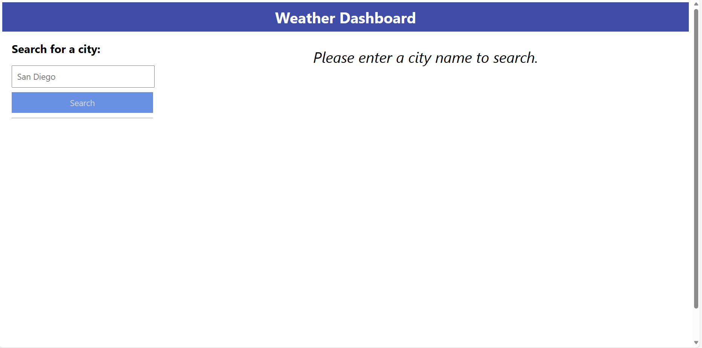
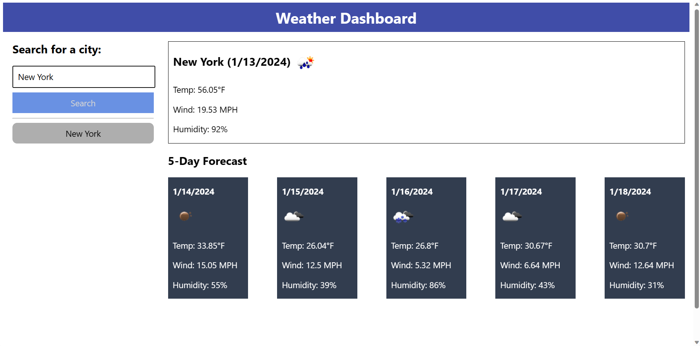

# Weather Dashboard

## Description

The Weather Dashboard is a dynamic application that provides real-time weather updates for any location around the globe. It allows users to search for a city and instantly receive current weather conditions, including temperature, humidity, wind speed, and UV index. The application also provides a 5-day forecast to help users plan ahead. The Weather Dashboard remembers your recent searches, making it easy to keep track of multiple locations. With its intuitive and user-friendly interface, staying informed about the weather has never been easier.

## Features

1. **Real-Time Weather Updates**: Provides current weather conditions including temperature, humidity, wind speed, and UV index.
2. **5-Day Weather Forecast**: Offers a comprehensive 5-day forecast to help users plan their activities.
3. **Search Functionality**: Allows users to search for any city around the globe.
4. **Recent Searches**: Keeps track of your recent searches for easy access to frequently checked locations.
5. **User-Friendly Interface**: An intuitive and easy-to-navigate design that makes checking the weather a breeze.

## Screenshots

## Link to Deployed Application

link

## Running Locally

### Installation

No specific installation steps are required. Simply download the entire project files from the repository.

### Usage

To open the application locally, open the file named `index.html` and it will be opened in your browser. You can now use the application.
